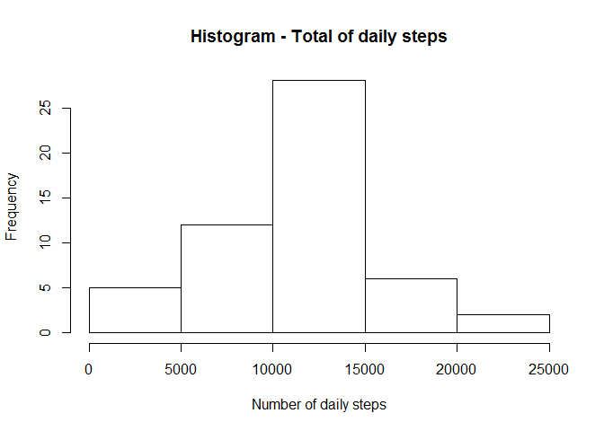
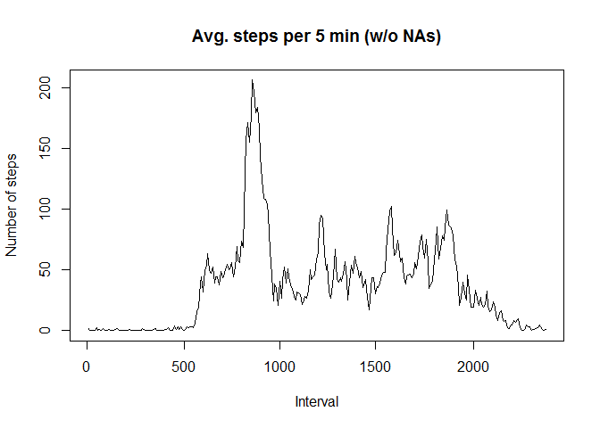
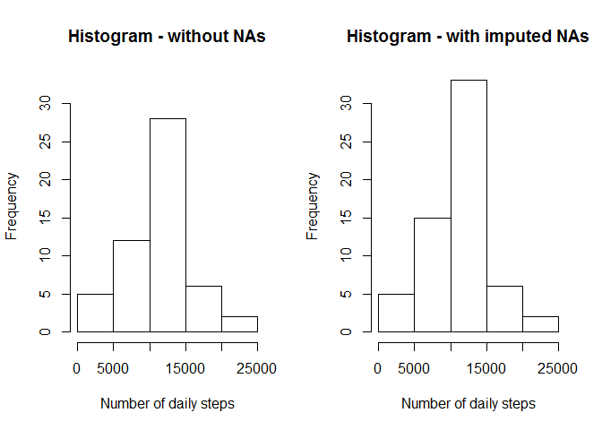
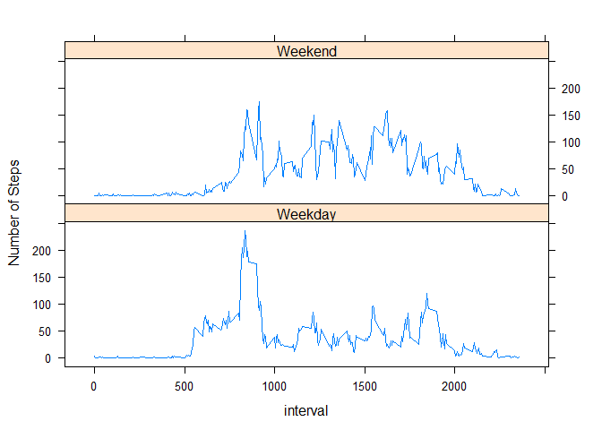

# Reproducible Research: Peer Assessment 1
## Introduction
This reports is an analysis of a collection of personal activity monitoring records from one individual. The data consists records about the number of steps taken within a 5-minute interval for a duration of two months. The collection took place in October and November 2012.  
  
The data can be download at 
https://d396qusza40orc.cloudfront.net/repdata%2Fdata%2Factivity.zip

and contains 17.658 observations with following variables:
- steps: number of steps taken in a 5min interval
- date: date of observation (format: YYYY-MM-DD)
- interval: identifier of the interval (format: numerical representation of hhmm)

## Loading and preprocessing the data
Step 0: load the data into memory & add time information for further analysis:

```r
require(lubridate)
require(lattice)
```

```r
dat <- read.csv(unzip("activity.zip"))
## add time-specific info
dat$day <- wday(dat$date, label = TRUE)
dat$intervalGroup <- paste0(dat$day, dat$interval)
dat$dayType <- c("weekday")
dat[which(dat$day == "Sat" | dat$day == "Sun"),6]  <- c("weekend")
dat$dayType <- as.factor(dat$dayType)
```
Step 1: subset for valid observations and calculate the number of daily steps

```r
dat1 <- dat[!is.na(dat$steps),]
# calculate the total number of steps taken per day and assign it 
totNoSteps <- as.data.frame(tapply(dat1$steps, dat1$date, sum ))
names(totNoSteps) <- c("dailySteps")

# prepare the data for mean and median calculation and store it in dataframe m1 for output
r1 <- as.data.frame(
    rbind(mean(totNoSteps$dailySteps, na.rm = TRUE), 
          median(totNoSteps$dailySteps, na.rm = TRUE)),
    row.names = c("Mean:","Median:")
    )
names(r1) <- c("Steps per day without NAs")
```
Step 2: Prepare data for the daily activity pattern analysis

```r
## calculate the average of steps per interval
avgNoSteps <- as.data.frame(tapply(dat1$steps, dat1$interval, mean, na.rm = TRUE))
names(avgNoSteps) <- c("noOfSteps")
## add the interval number as variable
avgNoSteps$interval <- row.names(avgNoSteps)
```
## What is mean total number of steps taken per day?
The following histogram shows the distribution of the total number of steps taken per day (excluding days with invalid observions):


```r
# create a histogram
hist(totNoSteps$dailySteps, main="Histogram - Total of daily steps", 
     xlab ="Number of daily steps") 
```

 
The mean total number and the median of steps taken per day is:

```r
print(r1)
```

```
##         Steps per day without NAs
## Mean:                    10766.19
## Median:                  10765.00
```
## What is the average daily activity pattern?
The following plot shows the activity pattern via daily number of steps per 5min slot (based on the days with valid observations):

```r
## plot
plot(avgNoSteps$noOfSteps, type ="l", 
     main ="Avg. steps per 5 min (w/o NAs)", 
     ylab =c("Number of steps"),
     xlab = "Interval", 
     tick = FALSE, 
     labels = FALSE)
## add interval names instead of index id
axis(1, at =c(0,61,121,181,243),    c(0,500,1000,1500,2000))
axis(2, at =c(0,50,100,150,200),    c(0,50,100,150,200))
```

 
The interval with the maximum number of steps is interval 

```r
avgNoSteps[which(avgNoSteps$noOfSteps == max(avgNoSteps$noOfSteps)),]
```

```
##     noOfSteps interval
## 835  206.1698      835
```
## Imputing missing values
The number of missing values in the observations is: 

```r
nrow(dat[is.na(dat$steps),]) 
```

```
## [1] 2304
```
In order to improve the timeseries analysis the missing values are populated with the mean number of steps of the corresponding day and interval.

```r
## calculate the mean per interval group (unique combination of day and interval)
datNotNA <- dat[which(!is.na(dat$steps)),]
avgStepsIntGrp <- as.data.frame(tapply(datNotNA$steps, datNotNA$intervalGroup, mean ))
avgStepsIntGrp$intervalGroup <- row.names(avgStepsIntGrp)
names(avgStepsIntGrp) <- c("avgSteps","intervalGroup")
## for NA - search each key - set field
full <- dat
full$steps_new <- full$steps
## for NAs: search each key - set field
for(i in 1:nrow(avgStepsIntGrp)){
    full[which(full$intervalGroup == avgStepsIntGrp[i,2] & is.na(full$steps_new) ), 7] <-     (avgStepsIntGrp[i,1])
    }
## calculate the number of daily steps after imputing data
totNoSteps2 <- as.data.frame(tapply(full$steps_new, full$date, sum ))
names(totNoSteps2) <- c("dailySteps")

## plot comparison of histograms
par(mfrow = c(1, 2))
hist(totNoSteps$dailySteps, main ="Histogram - without NAs", 
     xlab ="Number of daily steps", ylim = c(0,33)) 
hist(totNoSteps2$dailySteps, main ="Histogram - with imputed NAs", 
     xlab ="Number of daily steps", ylim = c(0,33))
```

 
The histogram with the imputed data shows slightly more activity before 10:00 am as its predecessor without the imputed data. This diffence resulting from "more" steps can be seen in a shift in the mean and median values also:

```r
# store the data in a matrix
m4 <- matrix(1:4,2,2)
dimnames(m4) <- list(c("Median", "Mean"))
colnames(m4) <- c("with NA", "imputed NA")
m4[1,2] <- median(totNoSteps2$dailySteps)
m4[2,2] <- mean(totNoSteps2$dailySteps)
m4[1,1] <- median(r1[2,1])
m4[2,1] <- mean(r1[1,1])
# display the results
print(m4)
```

```
##         with NA imputed NA
## Median 10765.00   11015.00
## Mean   10766.19   10821.21
```
## Are there differences in activity patterns between weekdays and weekends?

```r
##  aggregate per daytype
dfWeekDay <- full[which(full$dayType == "weekday"),]

avgStepsWeekDay <- as.data.frame(tapply(dfWeekDay$steps_new, dfWeekDay$interval, mean ), 
                                 row.names = 1:288)

avgStepsWeekDay <- cbind(unique(dfWeekDay$interval), avgStepsWeekDay, c("Weekday"))
names(avgStepsWeekDay) <- c("interval","steps","daytype")

dfWeekEnd <- full[which(full$dayType == "weekend"),]
avgStepsWeekEnd <- as.data.frame(tapply(dfWeekEnd$steps_new, dfWeekEnd$interval, mean ), 
                                 row.names = 289:576)

avgStepsWeekEnd <- cbind(unique(dfWeekEnd$interval), avgStepsWeekEnd, c("Weekend"))
names(avgStepsWeekEnd) <- c("interval","steps","daytype")

df6 <- rbind(avgStepsWeekDay, avgStepsWeekEnd)
```

There is a visible difference between weekday and weekend activity. The following plot shows a higher activity on weekdays than on weekend days, which might be caused by the regularly timed way to work.


```r
## create plot
xyplot(steps ~ interval | daytype, data = df6, 
       layout = c(1, 2), 
       ylab = "Number of Steps",
       type ="l")
```

 
